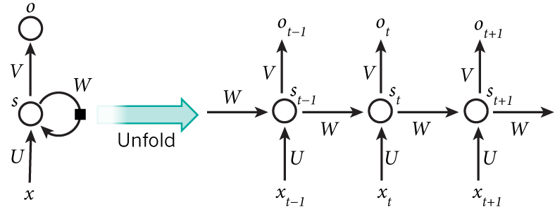
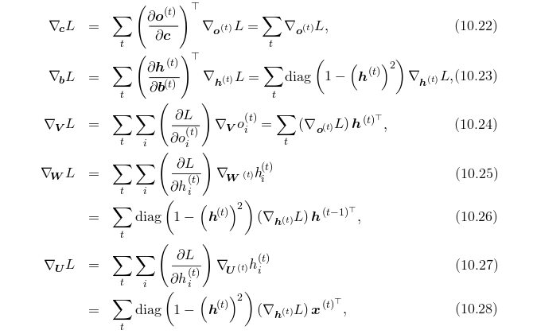
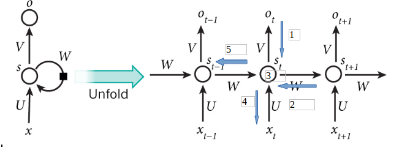
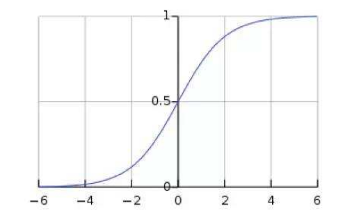

# vanilla RNN

------

RNN最大的特点在于同一隐藏层的各单元按照序列链接。  

通过这个图可以知道，RNN比CNN更适合处理具有一定序列的输入，因为RNN的结构决定了前面的输入必然能影响到后面的输出。这使得RNN在NLP这一领域获得了很大的成功。  

在学习RNN的过程过程中反向传播公式的推导应该是比较难的一个部分，因为像是CNN的反向传播只有一个方向，就是上一层传递给下一层，而RNN除了沿上下层的传播还有沿时间序列方向的传播。  

最终推导结果：  
c为隐藏层到输出的bias，b为输入到隐藏层的bais，推导过程比较长，以下这篇文章写得比较清晰[循环神经网络](https://zybuluo.com/hanbingtao/note/541458)以及[deeplearningbook](http://www.deeplearningbook.org/contents/rnn.html)写得比较清晰  

在编程过程中发现了一个比较容易出错的地方，那就是反向传播过程要注意残差在上下层之间传递，因为参考内容的推导过程主要是以一个隐藏层作为例子，所以写代码的过程要注意这一点，如下图，残差3要往4和5的方向传递，但要注意的是，残差3是有1,2两个方向的残差累加而成的。  

另一个需要注意的地方是，在某些任务（不是全部）中RNN的训练和测试是很不一样的，这里举的例子是cs231n的image captioning 问题。  

训练时因为知道正确的label，所以可以将ground-truth直接当成input输入到RNN当中，但是训练的时候，因为不知道ground-truth，所以要将前一个输出要当成后一个的输入。  
拿上面的图为例就是用x(t – 1)预测出o(t-1),然后将o(t-1)当成x(t)再次输入到网络。  

采用这种方式是因为cs231n的assignment3将图像的特征当成input输入到网络时只会预测出结果中的第一个词。  
采用的结构感觉是在one to many上做了一些变动。  

## Vanilla RNN的缺点
训练过程中容易发生梯度爆炸或梯度消失，产生的原因在参考资料[循环神经网络](https://zybuluo.com/hanbingtao/note/541458)中有详细说明。  

梯度爆炸可以简单用阈值方式解决。  
而解决梯度消失也有挺多的方式，参考资料[循环神经网络](https://zybuluo.com/hanbingtao/note/541458)中提到了三种常见的方式，我觉得进行batch normalization也应该可以缓解这种现象。  

# LSTM

------

如sigmoid函数，如果输入的模过大就会出现梯度消失的情况，LSTM为了解决这一问题加入了门和单元状态的概念，可以有效的控制前面输入对后面输出的影响。  

LSTM添加了三个门，遗忘门（forget gate）用以决定上一时刻的单元状态有多少能保留下来，输入门（input gate）用来决定输入状态有多少能进入到单元状态，输出门（output gate）用来决定单元状态有多少能输出到output  

c为单元状态（相当于一个容器），从左往右的三个X分别为遗忘门，输入门和输出门。  
反向传播公式的推导在参考资料[deeplearningbook](http://www.deeplearningbook.org/contents/rnn.html)和[LSTM](https://zybuluo.com/hanbingtao/note/581764)中有很详细的过程  

<figure class="third">
    
    
    
</figure>

状态单元c并不直接输出，在反向传播计算残差的时候要格外注意这一点。  

LSTM还有很多不同的变体，比如说GRU，GRU网上资料说是LSTM最为成功的一种变体，在后面的学习中会详细的去了解。  

一些想法  
RNN比较适合处理时序问题，之前还看过一篇博客，内容主要是在介绍RNN能做一些什么事情，里面比较有趣的是让电脑学会从左往右去看一张图片。  

# OCR

------

对于text recognition有两种比较常见的方法  
非端到端的OCR：需要进行预分割，特征提取，语义分析等环节，各环节之间存在一定关系  
端到端OCR：无需进行预分割，且整个过程是一个整体

